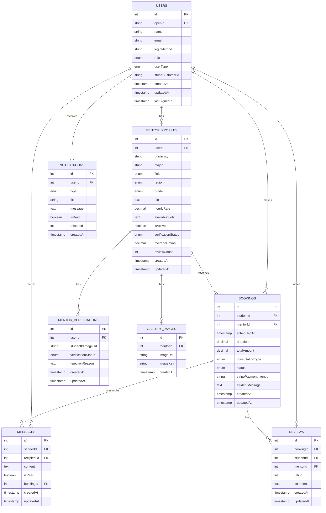
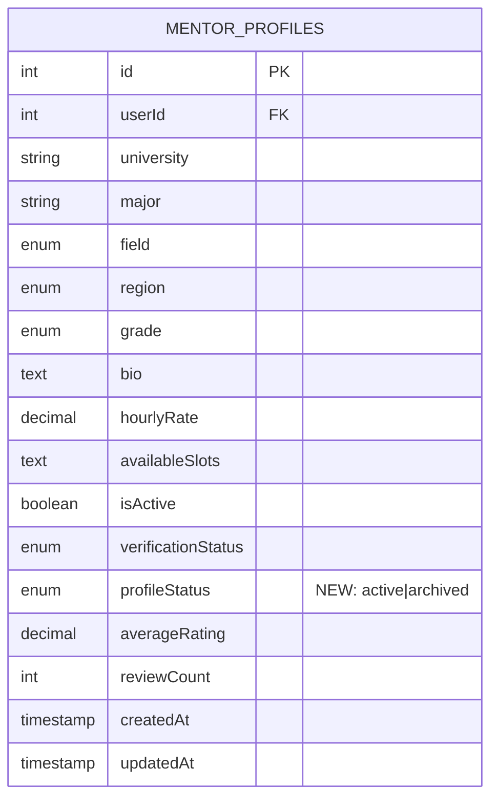

# 대학 멘토 매칭 플랫폼 - 데이터베이스 스키마

## 현재 스키마 다이어그램



## 현재 문제점

### 멘토 프로필 중복 문제

**상황:**
- `mentorProfiles` 테이블에 `userId`에 대한 UNIQUE 제약이 없음
- 같은 userId를 가진 여러 프로필이 동시에 존재 가능
- 프로필 삭제 후 재생성 시 혼동 발생

**예시:**
```
userId=1 (2003yunho)
├─ id=1 (한국대학교/학과공학과) - 삭제됨
└─ id=120001 (Test University/Computer Science) - 현재 사용
```

## 제안된 해결책

### 방법: `profileStatus` 필드 추가

`mentorProfiles` 테이블에 새로운 필드 추가:

```sql
ALTER TABLE mentor_profiles 
ADD COLUMN profileStatus ENUM('active', 'archived') DEFAULT 'active' NOT NULL;
```

**필드 설명:**
- `profileStatus = 'active'`: 현재 사용 중인 프로필 (최신 프로필)
- `profileStatus = 'archived'`: 삭제되거나 이전에 사용하던 프로필

**장점:**
1. 같은 userId에 여러 프로필 허용 가능
2. 삭제된 프로필과 현재 프로필 명확히 구분
3. 프로필 히스토리 추적 가능
4. 프로필 복구 기능 구현 가능

**쿼리 예시:**

```sql
-- 현재 활성 프로필만 조회
SELECT * FROM mentor_profiles 
WHERE userId = 1 AND profileStatus = 'active';

-- 사용자의 모든 프로필 히스토리 조회
SELECT * FROM mentor_profiles 
WHERE userId = 1 
ORDER BY createdAt DESC;
```

## 수정된 스키마 (제안)



**profileStatus 값:**
- `'active'` (1): 현재 사용 중인 프로필
- `'archived'` (0): 삭제되거나 이전 프로필
